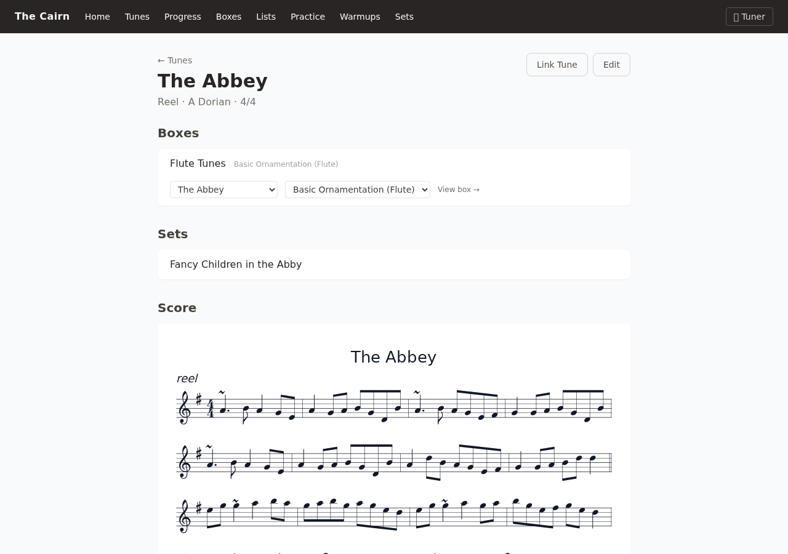
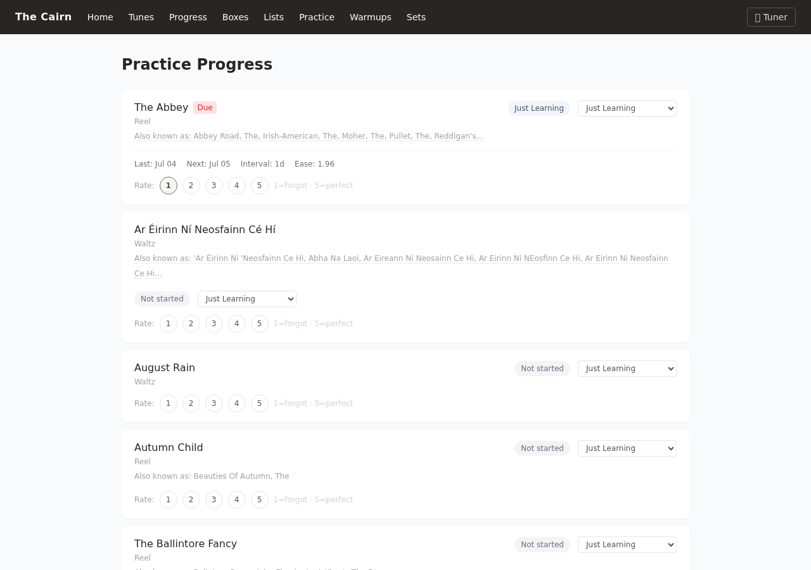
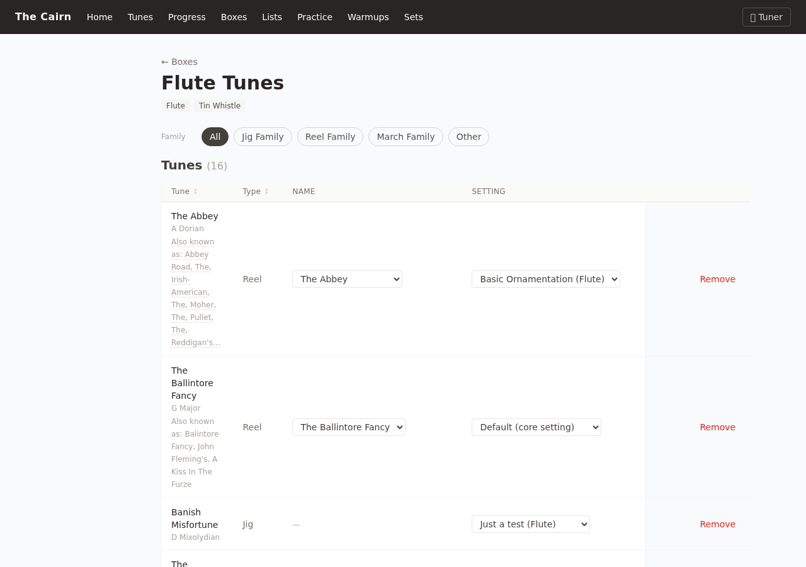
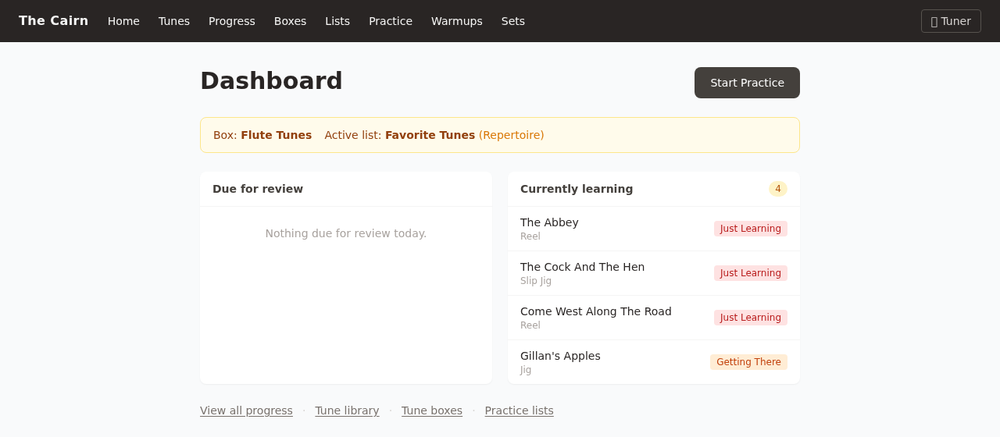

# The Cairn

[](https://github.com/torstees/the-cairn/actions/workflows/ci.yml)
[](https://the-cairn.app)
[](https://www.python.org/downloads/)
[](LICENSE)

A web app for learning and retaining traditional Irish music tunes — practice tracking,
spaced repetition, and interactive sheet music, built to declutter a student's desktop
and make the most of limited practice time.

Work in progress is tracked on [this GitHub Project board](https://github.com/users/torstees/projects/2/views/1).

<div align='center'>
       
```bash
       (o_o)
      <( : )>
       _/\_
     (========)
       (  )(    |)
   (  |  )(   )
 (  )(      )(    )
(________________)
```

</div>

## What it does

A tune isn't "learned" the moment you can play it once — retaining a repertoire of
traditional tunes takes structured, spaced-out practice, and most tools for managing
that (spreadsheets, tune books, memory) don't scale much past a dozen tunes. The Cairn
tracks a student's progress on every tune from *Just Learning* through *Solo Ready*,
schedules reviews with a spaced-repetition algorithm, and renders playable sheet music
directly from [ABC notation](https://abcnotation.com/) — no separate notation software
required.

It started as a tool for one student acting as their own teacher, but the data model
supports multiple students and teachers from the ground up.

| | |
|---|---|
|  |  |
| Interactive score, playback, and a live transpose control | Spaced-repetition progress, one rating away from the next review |
|  |  |
| A tune box: per-instrument settings, alternate names, and search | The daily dashboard — what's due, what's in progress |

## Key features

- **ABC notation rendering & playback** — tunes are stored as ABC and rendered client-side
  with [abcjs](https://abcjs.net/), including a metronome, drone, and adjustable playback speed.
- **Spaced repetition** — a `StudentProgress`-driven scheduler tracks each tune's status per
  student and surfaces what's due for review.
- **Boxes & lists** — organize tunes into instrument-specific "boxes" (with their own preferred
  settings and key/tempo per instrument) and practice lists for focused sessions.
- **Live transpose** — shift a tune up or down by semitones for viewing, with correct key-signature
  recomputation and enharmonic note respelling (not a naive letter-shift) — handy for checking
  whether a tune sits better in a different key on a given instrument.
- **Tune sets & practice sessions** — group tunes into sets for session/set practice, with an
  auto-built one-tune-at-a-time practice flow.
- **TheSession.org integration** — link a tune to its TheSession.org entry and import ABC settings
  directly.

## Stack

FastAPI + Jinja2 (server-rendered HTML, no SPA) + HTMX/Alpine.js for interactivity + SQLAlchemy 2.0
(async) + Alembic + SQLite (Postgres-compatible schema). No build step, no JS framework, no bundler —
a deliberate choice to keep the app simple to run, deploy, and hack on.

## Interesting Challenges
### Tuner Inaccuracies
The initial algorithm was a very simple looping approach with a short circuit once a valid pitch 
been identified. I tried this with a couple of quality flutes including both traditional types
and a concert flute, all from well respected makers, but the number of overtones that are emitted 
for certain notes on the flute was giving it a lot of trouble. Some notes were acceptable, though 
not exactly ideally stable. After a bit of research, I found found a more sophisticated algorithm, 
[McLeod's Pitch Detection](https://docs.rs/pitch-detection/latest/pitch_detection/detector/mcleod/index.html),
which was designed specifically for this purpose which fixed the problem. 

### Tablature 
Adding tablature in was done on a whim, since I know a lot of string players don't read music well
but might like the hints provided by a given setting's notes. I was suprised that the abcjs library
supported it out of the box. However, some tunes, as written for flute, fiddle and pipe where hitting
almost entirely on the highest string in the tablature. After some review of a couple of affected tunes,
I suggested identifying the lowest note and comparing that with the lowest string in the instrument's 
design and dropping an octave it it was safe to do so (my suggestion was 7 whole steps, which claude 
revised in semitones.)

## Running locally

```bash
uv sync                 # install dependencies
uv run alembic upgrade head   # apply migrations
make dev                 # uvicorn --reload on :8000
```

See `AGENTS.md` for the full architecture/conventions reference and `Makefile` for all
available dev tasks (`make test`, `make lint`, `make seed`, etc.).
